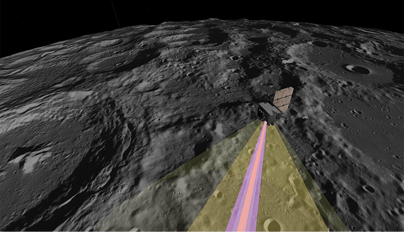
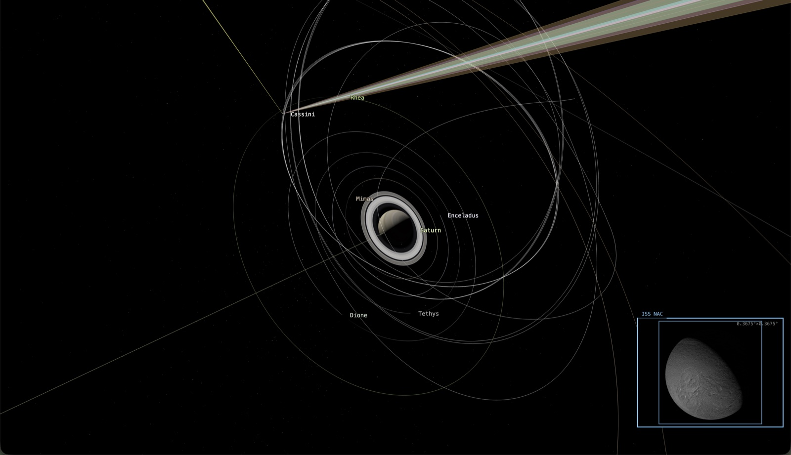
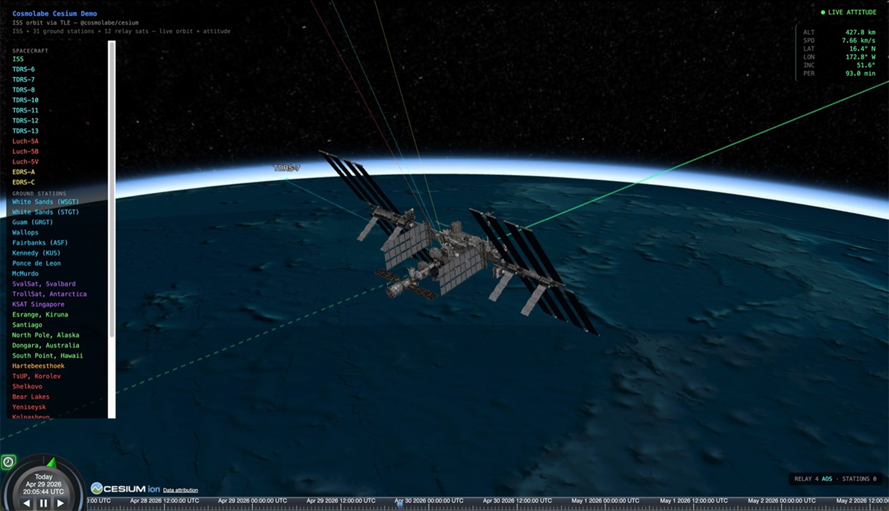
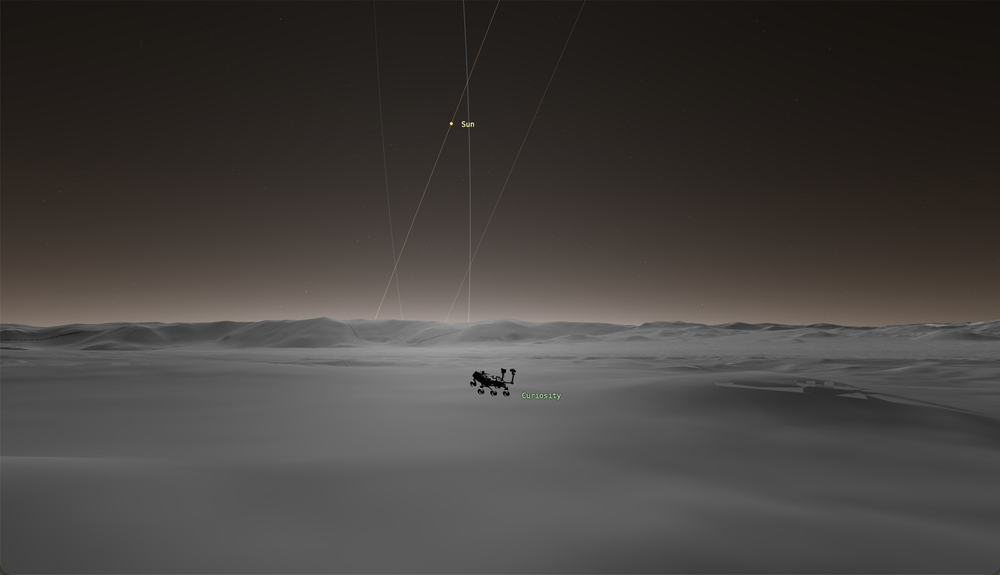

# Cosmolabe

[](LICENSE)
[](https://nodejs.org/)
[](https://www.typescriptlang.org/)

Web mission visualization — SPICE-accurate geometry, TLE tracking, planetary terrain, and a 3D renderer. A TypeScript monorepo for visualizing spacecraft missions in the browser. [Demo](https://aaronplave.com/cosmolabe/).

<!--
  HERO VIDEO  ────────────────────────────────────────────────────────────────
  How to add: open https://github.com/AaronPlave/cosmolabe/issues/new in a browser,
  drag the MP4 (≤10 MB, 5–8 s loop) into the comment textbox, wait for upload,
  copy the resulting `https://github.com/user-attachments/assets/<uuid>` URL,
  paste it into the `src` below, then close the draft without submitting.
  This serves the video from GitHub's CDN — no LFS bandwidth, no repo bloat.
  Recommended capture: LRO at the Moon w/ terrain streaming, or Cassini at Saturn.
-->
<p align="center">
  <video src="https://github.com/user-attachments/assets/3457a5fe-61f4-4884-9fa5-1a5fdc1312f2"
         autoplay loop muted playsinline
         width="800">
  </video>
</p>

You configure a scene by writing a **catalog** — a JSON file that names the bodies, their trajectories, their orientations, and what the viewer should draw. See **[docs/catalog-format.md](docs/catalog-format.md)** for the full reference. Catalogs support SPICE kernels, TLE data, Keplerian elements, and time-series simulation output — load any combination and get an interactive 3D mission visualization in the browser, no rendering code required.

Named after the [cosmolabe](https://en.wikipedia.org/wiki/Cosmolabe), Jacques Besson's 1566 universal instrument designed to replace the sphere, astrolabes, geometric square, quadrant, and celestial/terrestrial globes — one tool for astrometry, cartography, navigation, and surveying. The catalog format is adopted from NASA JPL's [Cosmographia](https://naif.jpl.nasa.gov/naif/cosmographia.html), a desktop visualization app originally created by Chris Laurel (author of [Celestia](https://celestiaproject.space/)) and SPICE-enhanced by NASA NAIF / ESA but no longer actively developed. Existing Cosmographia catalogs load unmodified, but you do not need any prior knowledge of Cosmographia to write one.

## Who It's For

Cosmolabe is built for engineers and developers who need to visualize where a spacecraft is — and what it can see — at a specific moment in time, in a browser, without standing up a desktop tool. **SPICE is one supported input among several; you do not need it.**

Typical users:

- **Mission engineers** preparing pre-flight reviews, public outreach, or operations dashboards. Drop in your SPICE kernels and a Cosmographia catalog and get an interactive 3D scene with no UI code.
- **Simulation / planning teams** (e.g. PlanDev or any similar planning/replay tool) replaying time-series spacecraft state — feed `InterpolatedStates` and tabulated quaternion attitude from sim output, no kernels required.
- **Satellite operators and CubeSat teams** tracking objects with TLE data — ISS, Starlink, debris, anything with a published TLE. Uses [satellite.js](https://github.com/shashwatak/satellite-js) for SGP4/SDP4 propagation.
- **Surface-ops developers** working on rovers, landers, or drone-swarm concepts. Quantized-mesh / 3D Tiles streaming terrain — plus an experimental Surface Explorer camera mode for ground-level navigation.
- **Web developers at space companies** embedding mission viz in larger dashboards — the renderer composes over Three.js or CesiumJS depending on what's already in your stack.

Representative use cases:

| Use case | What you load | Renderer |
|---|---|---|
| Live ISS tracker | TLE (no kernels) | Three.js or Cesium |
| Cassini at Saturn — full mission replay | SPK + CK + spacecraft model | Three.js |
| Lunar rover EDL + surface ops | SPK + DEM tiles + Surface Explorer (*experimental*) | Three.js |
| PlanDev sim result playback | `InterpolatedStates` from sim output | Three.js |
| Mission concept design / proposal viz | Keplerian elements + body catalog | Three.js |
| Globe-centric ops dashboard with comm relay | TLE + ground stations + CZML export | Cesium |

If your need is *one of these*, you're in the right place. If you need a 2D ground-track-only tool, an analysis backend without a renderer, or a fully-fledged trajectory optimizer, Cosmolabe is the wrong layer.

## What It Does

- **SPICE in the browser** — typed TypeScript wrappers over CSPICE compiled to WASM (via TimeCraftJS). Position/velocity, frame transforms, surface geometry, illumination, orbital elements, and geometry event finders (eclipses, occultations, conjunctions).
- **Catalog-driven scene configuration** — describe a scene declaratively in JSON: 10 trajectory types, 6 rotation models, 8 geometry types, and 4 inertial frames + body-fixed + two-vector frames. Existing Cosmographia catalogs load unmodified. See [docs/catalog-format.md](docs/catalog-format.md).
- **Queryable universe model** — `universe.getBody('LRO').stateAt(et)` returns SPICE-accurate position and velocity at any ephemeris time. Zero rendering dependencies in the core, so it's usable server-side or with any renderer.
- **Three.js rendering** — textured globes with DDS/JPG surface maps, streaming 3D terrain (quantized mesh, 3D Tiles, Cesium Ion, with WMS/WMTS/TMS imagery overlays), orbit trails, instrument FOV cones, eclipse umbra/penumbra shading, atmospheric scattering, planetary rings, star fields from the HYG catalog, labels, and geometry readouts.
- **CesiumJS adapter** — optional bridge for teams already invested in Cesium. CZML export, coordinate transforms, and a parallel renderer (`@cosmolabe/cesium`).
- **Off-thread trajectory caching** — Web Worker prebuilds adaptive samples (Visvalingam-Whyatt simplification) so scrubbing stays smooth on long missions.
- **Time controls** — play/pause, adjustable rate, scrub to any moment in a mission's timeline.

## Gallery

<!--
  Screenshots live in `docs/img/`. Source PNGs were ~3456×1990 retina captures;
  resized to 1600px wide and re-encoded as JPG (q=85) with sips. To add more,
  use:  sips -s format jpeg -s formatOptions 85 --resampleWidth 1600 src.png --out dst.jpg
  For motion clips (eclipse transitions, scrubbing), drop into a comment on a
  draft GitHub issue and embed via the user-attachments URL — same as the hero.
-->

| | |
|:-:|:-:|
|  |  |
| **LRO at the Moon** — high-res terrain streaming | **Cassini at Saturn** — rings + sensor frustums |
|  |  |
| **ISS live tracking** — TLE-driven, no kernels | **Curiosity at Dingo Gap** *(experimental)* — ground-level Mars via Surface Explorer |

## Repo Structure

```
cosmolabe/
├── packages/
│   ├── spice/            # @cosmolabe/spice           — CSPICE WASM bindings
│   ├── core/             # @cosmolabe/core            — Universe model (zero rendering deps)
│   ├── three/            # @cosmolabe/three           — Three.js rendering layer
│   ├── cesium-adapter/   # @cosmolabe/cesium-adapter  — CZML export + coordinate transforms
│   └── cesium/           # @cosmolabe/cesium          — CesiumJS rendering layer
├── apps/
│   ├── viewer/           # Three.js demo app (Svelte 5)
│   └── cesium-viewer/    # CesiumJS demo app
├── scripts/              # Build tooling (star catalog compiler, normal map generator)
├── package.json          # npm workspaces monorepo
└── tsconfig.json
```

`@cosmolabe/core` never imports `three` or `cesium`. The renderer packages compose over `core`. See [packages/cesium-adapter/CHOOSING_A_RENDERER.md](packages/cesium-adapter/CHOOSING_A_RENDERER.md) for guidance on which renderer fits your project.

### `@cosmolabe/spice`

Typed wrappers over the full CSPICE function library compiled to WASM. Handles all the `malloc`/`ccall`/`getValue`/`free` memory management and returns clean TypeScript objects.

**Wrapped functions:** `spkpos`, `spkezr`, `pxform`, `sxform`, `sincpt`, `subpnt`, `subslr`, `ilumin`, `oscelt`, `conics`, `bodvcd`, `bodvrd`, `gfposc`, `gfsep`, `gfoclt`, `gfdist`, `mxv`, `mtxv`, `vcrss`, `vnorm`, `vdot`, `utc2et`, `et2utc`, `et2lst`, `str2et`.

### `@cosmolabe/core`

Pure TypeScript universe model with no rendering dependencies. Usable server-side or with any renderer.

- **Universe** — body registry, time state, state queries
- **CatalogLoader** — parses [catalog JSON](docs/catalog-format.md): all 10 trajectory types, 6 rotation models, 8 geometry types, 4 inertial frames, plus body-fixed and two-vector frames
- **Trajectories** — FixedPoint, Keplerian, Spice, InterpolatedStates, Composite, Builtin, ChebyshevPoly, LinearCombination, TLE (via satellite.js)
- **Rotations** — Uniform, Fixed, Euler, Spice, Interpolated, TrajectoryNadir
- **GeometryCalculator** — altitude, sub-spacecraft point, sun angles, orbital elements, eclipse/occultation detection
- **Plugin interfaces** — `SpiceScenePlugin` for data-only plugins, `RendererPlugin` for renderer-specific visualization

### `@cosmolabe/three`

Three.js rendering layer that syncs a `Universe` into an interactive 3D scene.

- **UniverseRenderer** — scene graph sync, origin-shifting for precision at planetary scales, multi-pass depth rendering
- **BodyMesh** — textured spheres with DDS/JPG surface maps, correct rotation, 3D model support (GLTF)
- **TerrainManager** — streaming terrain via 3d-tiles-renderer (quantized mesh, 3D Tiles, Cesium Ion, imagery tiles)
- **TrajectoryLine** — orbit trails with configurable duration, fade, and color (incl. per-segment colors)
- **SensorFrustum** — instrument FOV visualization (elliptical, rectangular)
- **InstrumentView** — camera frustums with projected imagery
- **AtmosphereMesh** — Rayleigh + Mie limb scattering (adapted from Celestia's algorithm)
- **EclipseShadow** — analytical body-to-body umbra/penumbra shading
- **RingMesh** — planetary rings
- **StarField** — naked-eye stars from the HYG catalog with magnitude-based filtering
- **LabelManager**, **GeometryReadout**, **EventMarkers** — UI overlays
- **CameraController** — orbit camera, body tracking, smooth transitions, keyboard shortcuts. Surface Explorer mode for ground-level navigation is *experimental*.
- **TimeController** — play/pause/rate/scrub
- **TrajectoryCache + SpiceCacheWorker** — off-thread adaptive sampling and Visvalingam-Whyatt simplification for long-arc trajectories
- **Plugins** — TrajectoryColor, ManeuverVector, CommLink, Screenshot (GroundTrack pending)

### `@cosmolabe/cesium-adapter`

Standalone bridge into CesiumJS. CZML export, coordinate transforms (ICRF ↔ ecliptic ↔ planetary fixed frames), time conversions. The cesium peer dep is optional — useful as a build target when you don't want to ship the renderer.

### `@cosmolabe/cesium`

CesiumJS rendering layer composing over `@cosmolabe/core` and `@cosmolabe/cesium-adapter`. Body entities, surface points, comm links, ground tracks. Demonstrated by `apps/cesium-viewer` (live ISS tracking + relay/eclipse demos).

### Viewer Apps

- **`apps/viewer/`** — Three.js + Svelte 5 demo app. Drag-drop a [catalog JSON](docs/catalog-format.md) (and optional SPICE kernel files), or pick from built-in demos: LRO at the Moon (16K textures), Europa Clipper at Jupiter, Cassini at Saturn (with rings + sensor frustums), ISS (TLE-propagated), inner solar system, Saturn system, Earth-Moon, and MSL at Dingo Gap (Curiosity rover with high-res Mars terrain — *experimental*).
- **`apps/cesium-viewer/`** — CesiumJS demo featuring live ISS telemetry, eclipse highlighting, and ground-station comm relay.

## Getting Started

This repo uses [Git LFS](https://git-lfs.com/) to host demo SPICE kernels, 3D models, and large textures. Without LFS the placeholder pointer files won't resolve and demos will fail to load.

```bash
git clone https://github.com/AaronPlave/cosmolabe.git
cd cosmolabe
git lfs pull          # required — fetches kernels, models, textures
npm install
npm run build         # typecheck + build all packages
npm test              # run vitest
```

To run a viewer:

```bash
cd apps/viewer && npm run dev          # Three.js viewer
# or
cd apps/cesium-viewer && npm run dev   # Cesium viewer
```

Open the viewer and choose a demo catalog, or drag in your own [catalog JSON](docs/catalog-format.md) (plus any SPICE kernels it references).

### Running Tests

```bash
npx vitest run                                  # all tests
npx vitest run packages/core                    # one package
npx vitest run --reporter=verbose <test-name>   # debug single test
```

274+ tests across 30 files covering SPICE wrappers, trajectory math, catalog parsing, geometry calculations, CZML export, and coordinate transforms. Tests that depend on SPICE kernels live under `packages/spice/test-kernels/` and `apps/viewer/test-catalogs/kernels/` — both are LFS-tracked.

## Architecture

```
┌─────────────────────────────────────┐
│           Viewer Apps               │   Drag-drop UI, time controls
├──────────────────┬──────────────────┤
│ @cosmolabe/three │ @cosmolabe/cesium│   Renderer layers
├──────────────────┼──────────────────┤
│                  │ /cesium-adapter  │   CZML + coordinate transforms
├──────────────────┴──────────────────┤
│         @cosmolabe/core             │   Universe model, catalog loader
├─────────────────────────────────────┤
│         @cosmolabe/spice            │   CSPICE WASM bindings
├─────────────────────────────────────┤
│           timecraftjs               │   CSPICE compiled to WASM (npm dep)
└─────────────────────────────────────┘
```

Key constraints:
- `core` never imports `three` or `cesium` — it's a pure data model
- `spice` wraps the WASM layer and handles all memory management
- Renderer packages compose `core` with their respective rendering libraries
- The viewer apps are thin shells that wire everything together with a UI

## Adoption Model

**Tier 1 (today):** Write a [catalog JSON](docs/catalog-format.md) (optionally pointing at SPICE kernels) — get a full 3D mission visualization with no code. Trajectories, globes, terrain, instruments, time controls, stars, labels, event markers all come free from the catalog.

**Tier 2 (today):** Built-in configurable plugins for common patterns — `TrajectoryColorPlugin`, `ManeuverVectorPlugin`, `CommLinkPlugin`, `ScreenshotPlugin`. Enable with a few lines of config; data-agnostic, accept typed event arrays from any source. `GroundTrackPlugin` is pending.

**Tier 3 (today):** Custom `RendererPlugin` interface with typed `RendererContext` and `attachToBody()` lifecycle helpers — for novel instrument visualization, mission-specific overlays, or anything beyond the stock plugins.

## Status

| Area | Status |
|---|---|
| SPICE WASM layer (~25 typed wrappers) | Complete |
| Cosmographia catalog loader (full schema) | Complete |
| Three.js renderer | Complete |
| CesiumJS renderer + adapter | Complete |
| Eclipse shadows (analytical + SPICE) | Complete |
| Atmospheric scattering | Complete |
| Plugin system (6 patterns, 4 stock plugins) | Complete |
| Surface Explorer camera mode | Experimental |
| High-res Mars terrain (Dingo Gap demo) | Experimental |
| Ring shadows, night-side emission, Lunar-Lambert, bloom | Planned |
| `GroundTrackPlugin` | Planned |
| PlanDev sim-replay adapter | Planned |
| WebGPU renderer path | Future |
| Hosted demo | Not yet published |

## Planned Work

Two focus areas are driving most of the active work: **surface visualization** (ground-level atmosphere, rovers and landers, higher-resolution DEM and imagery overlays, promoting Surface Explorer out of experimental) and **library extensibility** (stabilizing the plugin API, more extension points, framework bindings, and making Cosmolabe a solid foundation to build real apps on top of). Other tracks include rendering polish (ring shadows, night-side emission, Lunar-Lambert, bloom), the PlanDev sim-replay adapter, CSPICE WASM modernization, and a hosted demo gallery with more example scenes.

See **[ROADMAP.md](ROADMAP.md)** for the full list.

## Contributing

Contributions welcome — see [CONTRIBUTING.md](CONTRIBUTING.md) for development setup, project layout, and PR guidelines. By contributing, you agree your contribution is licensed under Apache-2.0.

This project follows the [Contributor Covenant](CODE_OF_CONDUCT.md) code of conduct.

## Security

To report a vulnerability, see [SECURITY.md](SECURITY.md). Please do not file public issues for security concerns.

## Dependencies

| Dependency | Role |
|---|---|
| [timecraftjs](https://github.com/NASA-AMMOS/timecraftjs) | CSPICE compiled to WASM — provides all ~500 CSPICE functions |
| [three](https://threejs.org/) | 3D rendering |
| [3d-tiles-renderer](https://github.com/NASA-AMMOS/3DTilesRendererJS) | Streaming 3D terrain tiles |
| [cesium](https://cesium.com/platform/cesiumjs/) | Optional CesiumJS renderer + globe primitives |
| [satellite.js](https://github.com/shashwatak/satellite-js) | TLE/SGP4 orbit propagation |

## License

Apache-2.0. See [LICENSE](LICENSE) and [NOTICE](NOTICE).

This software is not approved or endorsed by NASA or JPL. It uses NASA-released open-source components (CSPICE via TimeCraftJS, 3DTilesRendererJS) but is independently developed and maintained.
