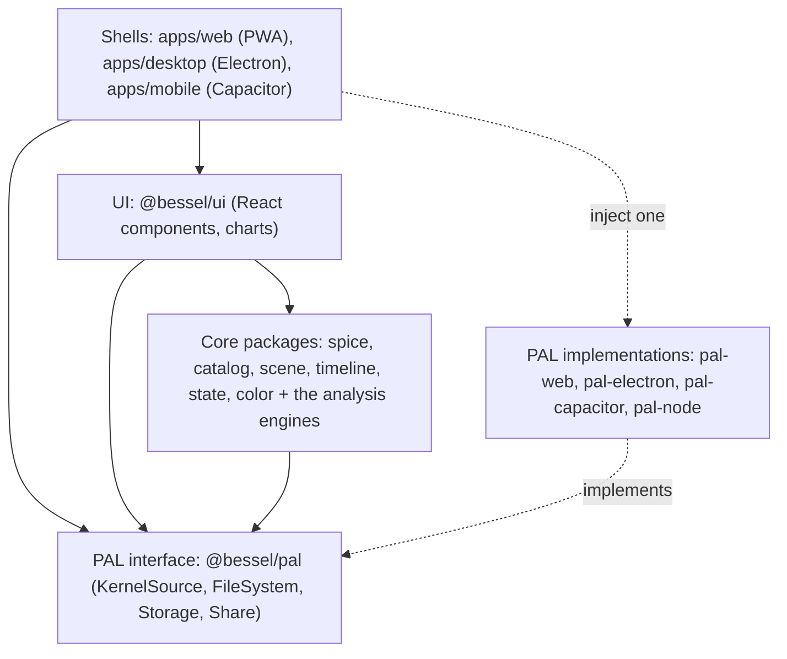
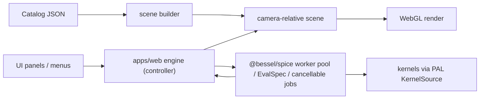

# Architecture Overview and Package Map

This is the navigable map of the monorepo: the binding layering, the 27 core
packages with one-line purposes, the data flow, and the cross-cutting mandates.
The binding decisions behind it are in docs/adr/; the requirements are in SPEC.md
(visualizer) and docs/STK_PARITY_SPEC.md (analysis engines).

## Layering (the dependency rule)

Lower layers never import higher ones, and the core never imports a concrete PAL
implementation.

```
plugins  ->  core packages  ->  PAL interface  ->  UI  ->  shells
```



- Core packages (`@bessel/spice`, `catalog`, `scene`, `timeline`, `state`,
  `color`, and the analysis engines) depend only on other core packages and the
  `@bessel/pal` interface.
- The UI (`@bessel/ui`) depends on core and the PAL interface.
- Shells inject exactly one PAL implementation at startup; the same engine then
  runs over HTTP range (web), the Electron filesystem, or Capacitor paths.

If a task tempts you to break this rule, the scope is wrong; stop and flag it.

## Core packages: visualization and platform

- `@bessel/spice`: the typed, promise-based API over CSPICE-WASM running in a Web
  Worker. Also hosts the F3 layer: the EvalSpec time-series interpreter, the
  cancellable-job protocol, the multi-worker pool, and the `PROVIDER_CATALOG`.
- `@bessel/catalog`: the native catalog schema, parsing, and the plugin registry.
- `@bessel/scene`: the camera-relative Three.js scene, the catalog-driven scene
  builder, picking, labels, the geometry builders, and the coverage-grid contour
  overlay (`coverage-overlay.ts` + `colormap.ts`). SPICE-free.
- `@bessel/timeline`: the clock, event annotations, the `SpiceWindow` interval
  algebra, and the shared zero-crossing geometry finder.
- `@bessel/state`: the view-URL codec (`v=1`), the MMGIS deep-link builder, CZML
  export, and the telemetry adapter.
- `@bessel/color`: color scales (e.g. trajectory fade).

## Core packages: analysis engines

All depend only on `@bessel/spice` (for geometry) and other core packages; they
are pure where the math is pure and worker-backed where they compute over the
SPICE engine. Algorithm provenance is in REFERENCES.md.

- `@bessel/propagator`: SGP4 with TLE/OMM ingest, two-body and J2/J4 mean-element
  theory, SPK Type-13 publish, and the native Cowell HPOP (adaptive DOPRI5 with a
  pluggable force model: point-mass, NxN spherical harmonics, third-body,
  atmospheric drag, and solar radiation pressure). Plus the numerical substrate
  built on it: dense (continuous) output, switching-function event detection with
  terminal stops, the co-integrated State Transition Matrix, an Astrogator-class
  Mission Control Sequence executor with a differential corrector (nested targeting
  and finite burns), and the EOP-aware TEME to J2000 (IAU-76/80) transform for SGP4
  output.
- `@bessel/od`: orbit determination. A Gauss-Newton batch least-squares estimator
  and a sequential extended Kalman filter, with range, range-rate, and angle
  measurement models, seeded by the propagator's State Transition Matrix.
- `@bessel/access`: visibility/access windows (line-of-sight, range, facility
  elevation, range-rate, Sun exclusion via `gfsep`, az/el mask via `gfposc`,
  terrain-masked line of sight) and chained access. Depends on `@bessel/terrain`
  for the terrain-masked constraint.
- `@bessel/events`: eclipse and lighting intervals (umbra/penumbra/annular/sunlit),
  the solar beta angle, and solar-intensity/penumbra-fraction from a two-circle
  lens overlap.
- `@bessel/rf`: link budgets, antenna gain, off-axis antenna patterns with pointing
  and polarization loss, BER (BPSK/QPSK and M-PSK/M-QAM with a modcod table and link
  margin), Doppler, ITU-R attenuation with rain sky-noise temperature, and the
  comm-entity schema.
- `@bessel/coverage`: figure-of-merit reduction (with revisit/response-time and
  access-duration statistics, plus area-weighted coverage), grid sweep, N-fold,
  and Walker constellation generation.
- `@bessel/conjunction`: closest approach, 2D probability of collision (Foster and
  full 2x2-covariance Mahalanobis), B-plane projection, the Alfano maximum Pc, and
  epoch-covariance STM propagation to the time of closest approach. Depends on
  `@bessel/propagator` for the STM-based covariance propagation.
- `@bessel/attitude`: two-vector pointing laws, eigen-axis slews, and keep-out
  constraints.
- `@bessel/sensors`: field-of-view geometry, ellipsoid footprints, and swath
  accumulation.
- `@bessel/mission`: Lambert and impulsive maneuvers in the standard frames.
- `@bessel/map-projection`: equirectangular, Web Mercator, and polar-stereographic
  projections.
- `@bessel/interop`: CCSDS OEM/CDM/AEM parse, OEM-to-SPK import, and CSV/CZML
  export (CCSDS OMM parse lives in `@bessel/propagator`).
- `@bessel/analysis`: vector-geometry tools and time-series statistics.
- `@bessel/terrain`: terrain-masked line of sight.

## Core packages: automation

- `@bessel/sdk`: the programmatic automation facade plus a serializable JSON
  batch-job IR (the `defineJob` builder lowers to the same IR a hand-written job
  parses into) and a headless `runJob` runner that composes the compute core
  (furnish kernels, load a catalog, propagate, run an MCS, analyze range/eclipse/
  access/link-budget, report, export OEM/CSV) deterministically with CI-grade exit
  codes and a provenance manifest (kernel and output content hashes). A shipped JSON
  Schema mirrors the hand-written validator. Depends only on core packages and the
  `@bessel/pal` interface; a shell injects the concrete Node IO.

## PAL and shells

- `@bessel/pal`: the platform-abstraction interface (`KernelSource`, `FileSystem`,
  `Storage`, `Share`). The SPICE engine never reads kernel bytes directly; kernels
  arrive through `KernelSource`.
- `@bessel/pal-web`, `@bessel/pal-electron`, `@bessel/pal-capacitor`: the three
  GUI-shell implementations. `@bessel/pal-node` is the headless Node IO (a
  directory-backed `KernelSource` plus an output-dir-confined writer) the SDK
  runner and CLI inject.
- `apps/web` (the PWA, the reference shell), `apps/desktop` (Electron via
  electron-vite), `apps/mobile` (Capacitor iOS), and `apps/cli` (the `bessel`
  headless batch runner over `@bessel/sdk` + `@bessel/pal-node`). Each injects one
  PAL.

## Data flow



- A loaded catalog drives the scene graph through the scene-builder seam; the same
  builder renders the bundled samples and any arbitrary mission.
- UI actions call the app's engine controller, which drives the SPICE worker
  (single client for normal rendering; the pool and `evalSeries` for heavy,
  cancellable sweeps), the clock, and the scene.
- Heavy compute stays off the main thread; series results transfer zero-copy.

## Web shell: the analysis workbench

The reference shell (`apps/web`) hosts the analysis workbench, the consolidated
right-dock "Analyze" panel (`panels/AnalyzeWorkbench.tsx`). Its structure mirrors the
analyst's intent rather than the engine list. For the user-facing guide see
docs/analysis-workbench.md and docs/analysis-personas.md.

- Six intent-named domain panels, each a tab owning the engines that compose for one
  inner loop: `OrbitManeuverPanel` (propagation, MCS, OD, slew, Lambert/porkchop),
  `LightingGeometryPanel` (range, ground track, beta, eclipse, solar intensity),
  `AccessCommsPanel` (constraint-stack access, in-FOV, downlink, station passes, link
  worksheet, slew feasibility, observation schedule), `ConjunctionPanel` (ingest +
  screen, per-event Pc + B-plane, watchlist, closest approach), `CoveragePanel`
  (Walker designer + sweep), and `ReportComparePanel` (report, OEM export, compare).
  Each tab body is `React.lazy` (`panels/lazy.tsx`), so it stays out of the
  first-paint shell; within a tab, tools are collapsible `TaskCard`s in a capped
  accordion (`panels/TaskCard.tsx`).
- The Scenario Object Model is a typed store slice (`scenario` in
  `store/app-state.ts`): role SLOTS the tasks read by role (primary spacecraft and
  its editable source, secondary objects, the ground-station registry with an active
  station, the observation target, and the asset set). The shared context bar
  (`panels/AnalysisContextBar.tsx`) and the spacecraft-source and station-registry
  controls write these slots; every tab reads them by default. An `AnalysisLauncher`
  search and a `PresetBar` of mission-profile chips are accelerators over the same
  tab/card expand path.
- The compute behind the cards lives in the app engine controller (`engine/engine.ts`)
  and the lazy ops module (`engine/analysis-ops.ts`), loaded behind a dynamic import
  so the engines are not in the first-paint shell.
- Dedicated worker seams keep heavy sweeps off the main thread, each with its own size
  budget in `.size-limit.json`: the SPICE worker (`spice.worker.ts`), the conjunction
  screening worker (`screening.worker.ts`), the coverage sweep worker
  (`coverage.worker.ts`), and the Lambert porkchop worker (`porkchop.worker.ts`). Each
  reports progress and is cancellable.
- The conjunction ingestion path is real, not synthetic: pasted CCSDS CDM / CCSDS OEM
  / TLE-set text is parsed (`parseCdm` / `parseOem` / `parseTle` via `@bessel/interop`
  and `@bessel/propagator`) into a screening catalog, the all-vs-all screen runs over
  that catalog on the screening worker, and a selected event computes the
  full-covariance Pc and Max-Pc with a B-plane plot; an assumed covariance can be
  supplied when the catalog carried none.

## Cross-cutting mandates

- Camera-relative rendering is mandatory: positions are computed relative to the
  camera before reaching float32 GPU buffers (never raw solar-system-scale
  coordinates).
- Fail loudly: missing kernels, unresolved bodies, and bad references produce
  explicit, located, typed errors; the camera never silently re-centers.
- Kernels arrive only through the PAL `KernelSource`; never embedded, never read
  directly by the engine.
- Browser persistence uses OPFS and the PAL `Storage` interface, not ad hoc
  globals, so the PWA model holds.

## Where to go next

- docs/adr/: the binding decisions (tri-target delivery, Three.js, CSPICE-WASM,
  kernel hosting, catalog schema, plugins, AMMOS/MMGIS integration, the production
  baseline).
- docs/build-from-source.md: building each target and relinking CSPICE-WASM.
- SPEC.md and docs/STK_PARITY_SPEC.md: the requirements and the analysis-layer
  status.
- Per-package READMEs (where present): the public API and dependency rule per
  package.
